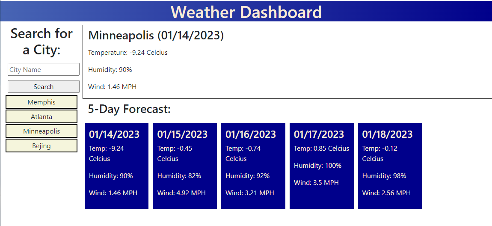

# 06 Weekly Weather

Name: Greg Trahan

Click [here](https://greg-trahan.github.io/06-weekly-weather/) to see my final project.

## Description

The goal of this assignment is create a webpage that would display the weather for the upcoming week in a city selected by the user.

## Usage

This application can be used to predict the weather for the upcoming week.

## What I did

I constructed a webpage from scratch that will display the weather for the upcoming week for Minneapolis MN, based on data from the openweathermap.org API. Users can additionally choose to enter any other city to recieve weather information about that city. The cities entered are saved to local storage and displayed so they can be easilly accessed in the future.

## What I learned

I learned about how to access server-side-APIs and how to incorporate the data from tehm into a dynmaic webpage.
